# ADR-001: Authoritative orchestration state machine

- Status: proposed
- Scope: server orchestration for issue work, task execution, project progress, external waits, review, retry/reassignment, and self-iteration
- Decision owner: engineering manager (cross-review required)
- Target: incremental rollout on Handoff staging before production enablement

## Context and code evidence

Today orchestration is inferred from several independently mutable records:

- `issue.status` is a human-facing workflow field with seven values. `backlog` suppresses enqueue, while moving an assigned issue to another active status may enqueue work (`server/internal/service/issue.go`, `shouldEnqueueAgentTask`).
- `agent_task_queue.status` is the execution lifecycle. Claim uses `FOR UPDATE SKIP LOCKED`, serializes the same agent and issue/chat, and orders by priority then creation time (`server/pkg/db/queries/agent.sql`, `ClaimAgentTask`). It has its own retry lineage, attempts, leases, deferred execution, and local-directory wait.
- Reassignment and issue terminal status deliberately do not cancel already active tasks (`server/internal/handler/issue.go`; `CancelAgentTasksByIssue` is deletion-only). Consequently issue ownership and execution ownership can legitimately diverge.
- Parent progress is computed from child issue statuses. A closed Stage only posts a system comment and wakes the parent assignee; advancement is agent-driven (`server/internal/handler/issue_child_done.go`). The same file explicitly states that `nextStage == 0` cannot distinguish a true final stage from lazily-created future work.
- Autopilot run state is projected separately. A create-issue run completes when its issue enters `done` **or `in_review`**, fails on `blocked`, and a linked task failure is terminal only when no active task remains (`server/internal/service/autopilot.go`, `SyncRunFromIssue`, `SyncRunFromLinkedIssueTask`). This currently conflates a review fence with completion and an external wait with failure.

The absence of queued work therefore does not mean the system is done. It can mean completion, review, external input, a future retry, a parked Stage, a lost wake-up, an offline runtime, or a state-reconciliation defect.

## Decision

Introduce a server-owned orchestration aggregate per issue. It is the sole authority for machine progress; existing Issue, task, and Autopilot fields remain source records for their own domains and become inputs/projections of this aggregate.

```text
issue (human intent) ─┐
task attempts ────────┼─> orchestration reducer ─> orchestration_state + outbox
children/stages ──────┤                              ├─> ready queue
review/external input ┘                              ├─> issue projection
                                                     └─> autopilot projection
```

### Aggregate state

`issue_orchestration` contains one row per orchestrated issue:

| Field | Contract |
| --- | --- |
| `issue_id`, `workspace_id` | Aggregate identity and tenant boundary. |
| `phase` | `planned`, `ready`, `executing`, `waiting`, `review`, `completed`, `cancelled`, `faulted`. |
| `wait_kind` | Nullable: `external_input`, `dependency`, `stage_gate`, `retry_backoff`, `runtime_capacity`, `review`. |
| `desired_assignee_type/id` | Who should receive the next execution; does not rewrite an in-flight attempt. |
| `active_execution_id` | Nullable pointer to the one aggregate-owned active execution generation. |
| `generation` | Monotonic integer incremented whenever new work/reassignment/retry invalidates an older execution generation. |
| `version` | Optimistic concurrency token incremented by every reducer commit. |
| `ready_at`, `wake_deadline_at` | Claim eligibility and watchdog deadline. |
| `terminal_reason`, `last_error_code` | Structured outcome/fault; never free-text control flow. |
| `created_at`, `updated_at` | Audit timestamps. |

The existing issue status remains the user-facing projection:

| Orchestration phase | Issue status projection |
| --- | --- |
| `planned` | `backlog` |
| `ready` | `todo` |
| `executing` | `in_progress` |
| `waiting` | `blocked` only for actionable external/dependency waits; otherwise retain `in_progress` and expose wait detail |
| `review` | `in_review` |
| `completed` | `done` |
| `cancelled` | `cancelled` |
| `faulted` | `blocked` with `orchestration_fault` detail |

Issue status writes become commands interpreted by the reducer, not direct machine-state truth. During compatibility mode, legacy writes update both records transactionally.

### State transitions

```mermaid
stateDiagram-v2
    [*] --> planned
    planned --> ready: activate / dependency satisfied
    ready --> executing: execution claimed
    executing --> review: deliverable submitted
    executing --> waiting: external/dependency wait declared
    executing --> ready: retryable failure / reassignment generation
    executing --> faulted: terminal execution failure
    waiting --> ready: matching wake event
    waiting --> faulted: wake deadline exceeded without valid wait owner
    review --> ready: changes requested
    review --> completed: independent approval
    ready --> cancelled: cancel
    executing --> cancelled: cancel intent; execution becomes superseded
    waiting --> cancelled: cancel
    review --> cancelled: cancel
    completed --> ready: explicit reopen (new generation)
    faulted --> ready: operator recovery
```



Invariants:

1. At most one non-superseded execution per `(issue_id, generation)`.
2. `executing` requires an active execution whose task is `dispatched`, `running`, or `waiting_local_directory`.
3. `ready` requires a durable ready item or an outbox event that will create one.
4. `waiting` requires `wait_kind`, a responsible actor/system, and either a wake correlation or a deadline.
5. `review` cannot be completed by the execution author; approval records an independent actor identity.
6. Terminal phases have no active execution and no unconsumed ready item.
7. A stale task callback may finish its task attempt for audit, but cannot mutate the aggregate when its generation/execution token no longer matches.

### Ready queue and active execution

Add `orchestration_ready_item` rather than deriving readiness from Issue status:

- unique live key: `(issue_id, generation, purpose)` where `purpose` is `execute`, `retry`, `review_fix`, or `continue_parent`;
- claim transaction selects due items with `FOR UPDATE SKIP LOCKED`, validates aggregate version/phase, creates the task execution, sets `active_execution_id`, and moves the aggregate to `executing`;
- runtime capacity and local-directory locks remain execution-layer concerns. They do not consume business readiness permanently;
- task priority remains a scheduling input, not orchestration truth.

`orchestration_execution` binds an aggregate generation to the concrete `agent_task_queue.id`, assignee snapshot, attempt, and terminal disposition (`succeeded`, `retryable_failed`, `terminal_failed`, `superseded`, `cancelled`). This preserves current task retry/session behavior while preventing old attempts from advancing new ownership.

### Parent progress and self-iteration

Parent progress is a reducer projection, not a comment side effect:

```text
child terminal event
  -> recompute lowest unfinished Stage in one transaction
  -> if Stage closes, append stage.closed event once
  -> if a declared later Stage exists, enqueue continue_parent once
  -> if no later Stage exists, evaluate project completion policy
```

Projects gain a versioned `iteration_policy` with an explicit terminal rule. Default policy:

1. All non-cancelled leaf issues are `completed` and no review/wait/active/ready/fault exists.
2. Emit `project.iteration_exhausted` with a snapshot hash.
3. If self-iteration is enabled, create exactly one `self_iteration_candidate` for `(project_id, snapshot_hash, policy_version)`. Candidate generation is a planning proposal, never an automatically approved production change.
4. Candidate states are `proposed`, `accepted`, `rejected`, `superseded`. Acceptance creates a new issue/Stage through the normal command path and changes the project back to active.

This removes the current ambiguity where “no next Stage exists yet” is guessed as completion. Lazy future work must be represented by a declared `stage_gate` wait or by an accepted candidate; otherwise the project is complete.

### Distinguishing empty-system outcomes

The coordinator exposes a deterministic classification:

| Classification | Predicate |
| --- | --- |
| `complete` | No active/ready/review/wait/fault; all scoped aggregates terminal; no accepted candidate awaiting materialization. |
| `waiting_external` | At least one `waiting` aggregate with `external_input`, `dependency`, or `review`, plus owner/correlation/deadline. |
| `temporarily_not_ready` | Only future `ready_at`, retry backoff, runtime capacity, or Stage gates exist and every item has a wake/deadline. |
| `orchestration_fault` | Nonterminal aggregate has no active execution, ready item, valid wait, review request, or pending outbox event; or a deadline/lease invariant is violated. |

A periodic reconciler recomputes this classification and moves impossible nonterminal states to `faulted`; it never invents work silently.

## Command and API contracts

All mutation endpoints accept `Idempotency-Key` and optional `If-Match: <version>`. Reusing a key with a different request hash returns `409`; stale versions return `412`.

```text
POST /api/issues/{id}/orchestration/activate
POST /api/issues/{id}/orchestration/waits
POST /api/issues/{id}/orchestration/wake
POST /api/issues/{id}/orchestration/reassign
POST /api/issues/{id}/orchestration/retry
POST /api/issues/{id}/orchestration/submit-review
POST /api/issues/{id}/orchestration/review-decisions
POST /api/issues/{id}/orchestration/cancel
GET  /api/issues/{id}/orchestration
GET  /api/projects/{id}/orchestration-summary
GET  /api/projects/{id}/self-iteration-candidates
POST /api/projects/{id}/self-iteration-candidates/{candidateId}/accept
```

Task callbacks add opaque `execution_id`, `generation`, and `lease_token`. Completion/failure is idempotent: an identical terminal replay returns the stored result; a conflicting terminal replay returns `409`; a stale generation returns `202 superseded` after recording attempt telemetry.

Events use `event_id` as the consumer idempotency key and include `aggregate_id`, `aggregate_version`, `causation_id`, and `correlation_id`. Consumers ignore versions already applied.

## Transaction boundaries and delivery

1. **Command transaction:** lock `issue_orchestration`, validate version/invariants, append `orchestration_event`, update aggregate, ready/wait/review records, compatibility projections, and `orchestration_outbox`; commit once.
2. **Claim transaction:** lock one ready item with `SKIP LOCKED`, compare generation, create task + execution, consume ready item, update aggregate, append event/outbox; commit once. No network call occurs inside the transaction.
3. **Task terminal transaction:** CAS on task terminal state and execution lease/generation, update execution and aggregate, create retry/parent-ready item if applicable, append event/outbox; commit once. This replaces post-commit “best effort” cross-service synchronization.
4. **Outbox delivery:** workers publish at least once; consumers deduplicate by `event_id`. WebSocket, inbox, metrics, daemon wake, and Autopilot projections are consumers, not transaction participants.
5. **Reconciliation:** lease-based, `SKIP LOCKED`, bounded batch. It repairs missing projections/outbox delivery and marks invariant violations; it does not bypass reducer commands.

Do not add database foreign keys per repository policy. Application services validate related rows within the transaction; cleanup is explicit. New indexes use separate `CREATE INDEX CONCURRENTLY` migrations.

## Retry, reassignment, cancellation, and review fence

- Retry preserves the existing task lineage/session policy but increments only the attempt within the same orchestration generation. When the effective retry budget is exhausted, transition to `faulted`; do not infer `todo` from a failed task.
- Reassignment increments `generation`, marks the previous execution `superseded`, and enqueues the new desired assignee. The old process may finish, but its callback cannot advance the issue.
- Cancellation increments `generation` and sets cancel intent atomically. Best-effort process cancellation follows through the outbox; correctness does not depend on killing the process.
- Review submission creates a `review_request` containing immutable deliverable references/head SHA and author identity. Approval requires a different accountable member/agent according to policy. Changes requested increments generation and creates one `review_fix` ready item.
- Autopilot create-issue runs no longer complete at `in_review`; they remain `running/waiting_review` and complete only after orchestration `completed`. External wait is not an Autopilot failure unless policy/deadline says so.

## Compatibility and migration

Roll out behind workspace feature flag `authoritative_orchestration_v1`:

1. **Schema only:** aggregate/event/outbox/ready/execution/wait/review/candidate tables and concurrent indexes; no behavior change.
2. **Shadow reducer:** backfill one aggregate per nonterminal issue using the deterministic precedence `active task > review > structured wait > queued/deferred task > issue terminal/status`. Log divergences; do not write Issue status.
3. **Dual-write commands:** route Issue/task/Autopilot mutations through the reducer while continuing existing response fields and events. A transactional adapter writes legacy projections.
4. **Read shadow:** expose orchestration API and metrics; compare board status, task activity, parent Stage, and Autopilot outcomes in Handoff staging.
5. **Authority flip:** ready claiming and parent continuation read new tables. Legacy task APIs remain compatible and gain optional orchestration fields.
6. **Projection cleanup:** after at least one full retry/lease retention window with zero unexplained divergence, remove legacy side-effect paths; retain legacy columns as API projections until installed clients age out.

Rollback before step 5 disables dual write and leaves legacy behavior intact. After step 5, rollback switches claims back only after draining/marking new ready items and projecting aggregate state to Issue/task rows. Event/outbox data is retained for audit; no destructive down migration is required.

## Observability and SLOs

Metrics:

- `orchestration_state_total{phase,wait_kind}` and transition counters;
- ready age p50/p95/p99, claim latency, active execution age, lease expiry count;
- stale callback/superseded completion count;
- reducer conflict/idempotency replay count;
- outbox oldest-undelivered age and delivery attempts;
- projection divergence count by legacy surface;
- `orchestration_fault_total{invariant}`;
- project empty classification and self-iteration candidate counts.

Structured logs include workspace, project, issue, aggregate version, generation, command/event/idempotency IDs, and prior/new state. Alerts fire on undelivered outbox age, ready items without claims while capacity is online, active executions past lease, and any impossible nonterminal aggregate.

## Delivery slices and atomic commits

1. `feat(orchestration): add aggregate event and outbox schema` — migrations, generated queries, invariant tests.
2. `feat(orchestration): add reducer and idempotent command API` — pure transition table tests plus API concurrency/replay tests.
3. `feat(orchestration): make ready claim and task terminal atomic` — race, lease, stale generation, retry and reassignment tests.
4. `feat(orchestration): project parent stages and review fences` — Stage closure, independent reviewer, parent continuation tests.
5. `feat(orchestration): unify autopilot and external waits` — create-issue/run-only compatibility and deadline tests.
6. `feat(orchestration): add project completion and self-iteration candidates` — snapshot idempotency and accept/reject tests.
7. `chore(orchestration): enable staging shadow and reconciliation dashboards` — divergence fixtures and runbook.

Each slice is independently reviewable and deployable behind the flag. No slice combines schema authority flip with legacy-path removal.

## Acceptance checklist

- [ ] Concurrent activation/retry/reassign commands yield one live ready item and monotonic aggregate versions.
- [ ] Duplicate HTTP commands, task callbacks, and events are safe; conflicting reuse is rejected.
- [ ] Stale/superseded execution cannot move Issue, parent, project, or Autopilot state.
- [ ] Retry creation and parent Stage continuation commit atomically with terminal task handling.
- [ ] Review author cannot approve their own deliverable; changes requested creates exactly one next generation.
- [ ] External wait records owner, correlation, and deadline and resumes only from a matching wake.
- [ ] Empty ready queue is classified as complete, external wait, temporary not-ready, or fault with no ambiguous fifth outcome.
- [ ] Project completion creates at most one candidate per snapshot/policy version and never auto-approves it.
- [ ] Handoff staging shadow mode reports zero unexplained divergence for the agreed observation window.
- [ ] Rollback rehearsal restores legacy claiming without losing or duplicating accepted work.

## Consequences and risks

The decision adds storage and reducer complexity, but makes orchestration transitions auditable and removes correctness dependence on comments, WebSocket delivery, or timing between services. The largest risks are dual-write divergence and claim cutover. They are contained by a single reducer, transactional outbox, shadow comparison, generation fencing, and a staged authority flip. Existing task sessions, work directories, daemon protocol, and installed client fields remain compatible during migration.
